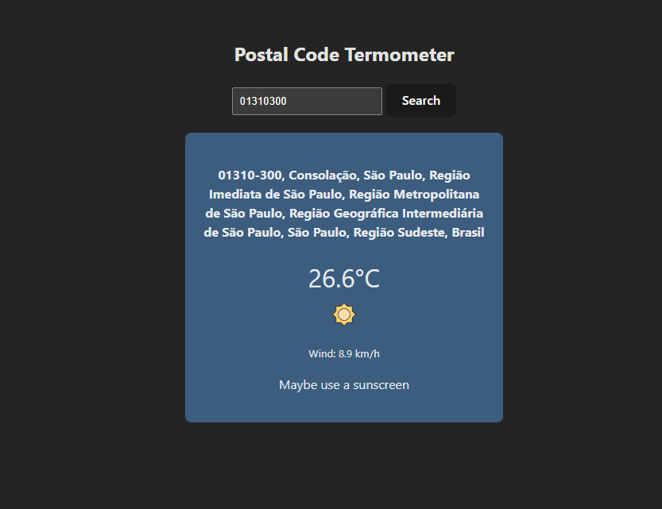

#Fetch Temperature

## A simple app to fetch the temperature with the postal code of the location.

##To start the server:

use "npx tsx src/index.ts" to start the backend server,
use "npm run dev" to start the frontend server

